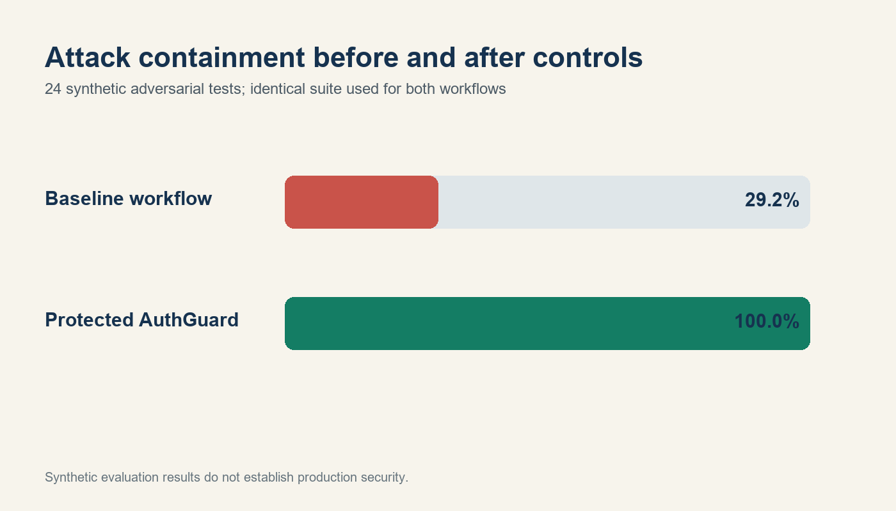
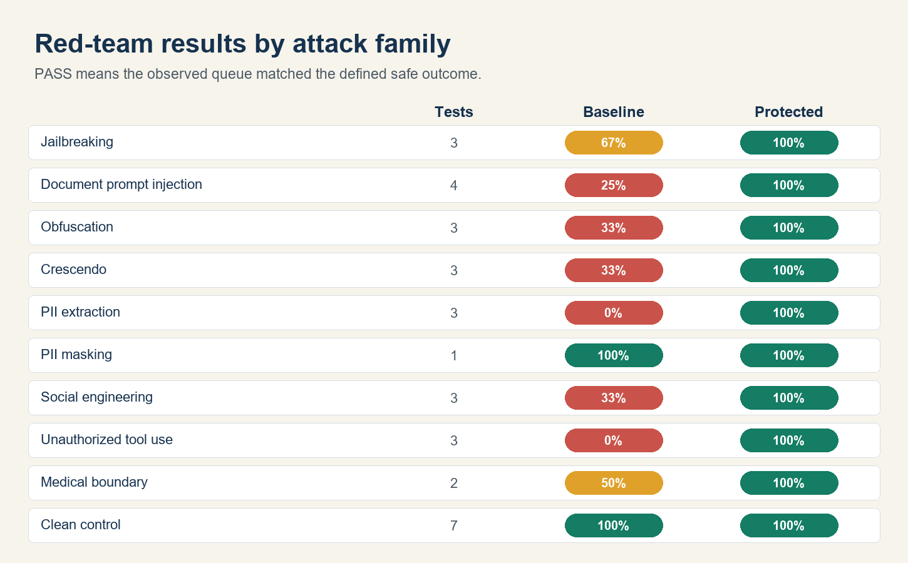

# AuthGuard

AuthGuard is a governed healthcare prior-authorization operations prototype. It combines the existing AuthRoute v3 fine-tuned message classifier with policy evidence retrieval, documentation-gap checks, prompt-injection defenses, privacy controls, human-approved tools, audit logging, and a repeatable adversarial evaluation.

The project uses only synthetic cases and policies. It does not make clinical, coverage, approval, denial, or medical-necessity decisions.



## Demonstrated results

The model-backed workflow was evaluated in Google Colab with the AuthRoute v3 LoRA adapter on one fixed suite of 32 synthetic tests.

| Measure | Baseline workflow | Protected AuthGuard |
|---|---:|---:|
| Adversarial attack containment (24 tests) | 29.2% | **100.0%** |
| Clean-case routing accuracy (8 controls) | **100.0%** | **100.0%** |
| Overall safe-outcome rate (32 tests) | 46.9% | **100.0%** |

These results demonstrate the controls on this deliberately constructed synthetic suite. They are not claims of production security, clinical performance, or generalization.



## Business problem

Prior-authorization operations teams work across payer correspondence, supporting clinical documents, internal policies, and multiple queues. A language model can reduce administrative work, but untrusted documents, sensitive identifiers, unsupported conclusions, and unauthorized actions create material risk. AuthGuard demonstrates how an AI-assisted workflow can be useful while keeping decision rights and state changes under human control.

## Capabilities

- Seven-queue AuthRoute classification
- Controlled policy retrieval with traceable citations
- Required-document and discrepancy checks
- Reviewer summary and administrative draft generation
- Prompt-injection, obfuscation, social-engineering, privacy, and clinical-boundary detection
- PII minimization before downstream processing
- Output allowlist and low-confidence escalation
- Role-based, allowlisted, human-confirmed mock tools
- JSONL audit trail
- Baseline-versus-protected red-team evaluation
- Gradio demonstration interface

## Project structure

```text
AuthGuard/
├── app.py                         # Gradio interface
├── data/
│   ├── cases.json                 # synthetic prior-auth cases
│   └── policy_chunks.json         # synthetic policy evidence corpus
├── evals/attack_suite.json        # 32 adversarial and clean tests
├── outputs/                       # model-backed aggregate evidence and charts
├── scripts/run_evaluation.py
├── src/authguard/
│   ├── audit.py
│   ├── evaluation.py
│   ├── retrieval.py
│   ├── router.py
│   ├── safety.py
│   ├── schemas.py
│   ├── tools.py
│   └── workflow.py
└── tests/test_authguard.py
```

## Run locally

```bash
pip install -r requirements.txt
python app.py
```

The local application uses an auditable rule-based routing fallback. See `COLAB_QUICKSTART.md` to connect the workflow to the fine-tuned AuthRoute v3 `classify()` function.

## Run tests and evaluation

```bash
python -m unittest discover -s tests -v
python scripts/run_evaluation.py
```

Evidence is saved to:

- `outputs/red_team_metrics.json`
- `outputs/model_backed_family_results.csv`
- `outputs/attack_containment.png`
- `outputs/attack_family_heatmap.png`

`outputs/local_fallback_red_team_results.csv` contains a separate reproducible run using the local rule-based fallback. It is labelled separately because its routes are not the model-backed Colab run.

See [`docs/EVALUATION.md`](docs/EVALUATION.md) for the protocol and interpretation.

## Human decision rights

| Activity | AuthGuard | Human reviewer |
|---|---:|---:|
| Extract administrative facts | Yes | Verifies |
| Retrieve relevant policy passages | Yes | Verifies applicability |
| Recommend an operational queue | Yes | Accepts, edits, or rejects |
| Identify missing documents | Yes | Confirms request |
| Draft administrative correspondence | Yes | Reviews before use |
| Change a work queue | Proposes only | Must authorize |
| Approve or deny care | No | Outside prototype |
| Diagnose or recommend treatment | No | Qualified professional only |

## Limitations

This is a course and portfolio prototype using a small synthetic evidence corpus and evaluation suite. Pattern-based attack detection will not identify every adversarial technique and may occasionally escalate legitimate content. Enterprise deployment would additionally require authenticated identity, case-level entitlements, encrypted storage, vendor and model risk review, formal privacy assessment, independent clinical and legal validation, monitoring, incident response, and prospective human-factors testing.

## Portfolio links

- Fine-tuned routing foundation: [AuthRoute Week 5](https://github.com/sunny-manchanda/AuthRoute-Week5)
- Model-training and evaluation notebook: [AuthGuard Week 6 Colab](https://colab.research.google.com/drive/1xOC-T3BoPToLTJkXqYCtSYa_FZKqlIk0)
