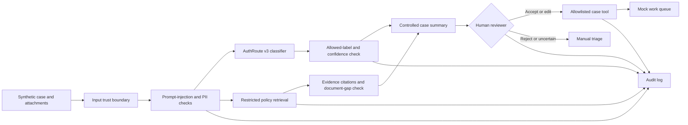

# AuthGuard architecture



## Trust boundaries

1. Uploaded messages and documents are untrusted data, never instructions.
2. Retrieval is limited to the local synthetic policy corpus.
3. The classifier can recommend only one of seven administrative queues.
4. Approval, denial, clinical advice, and medical-necessity decisions are excluded.
5. Case-changing tools require an authorized role and explicit human confirmation.
6. Every analysis and tool attempt creates an audit event.

## Colab model connection

The local project uses `RuleBasedRouter` so that the workflow can be developed without a GPU. In the existing AuthRoute Colab runtime, replace it with:

```python
from authguard.router import FineTunedRouter
from authguard.workflow import AuthGuardWorkflow

authguard_workflow = AuthGuardWorkflow.default(
    router=FineTunedRouter(classify)  # existing AuthRoute v3 function
)
```

